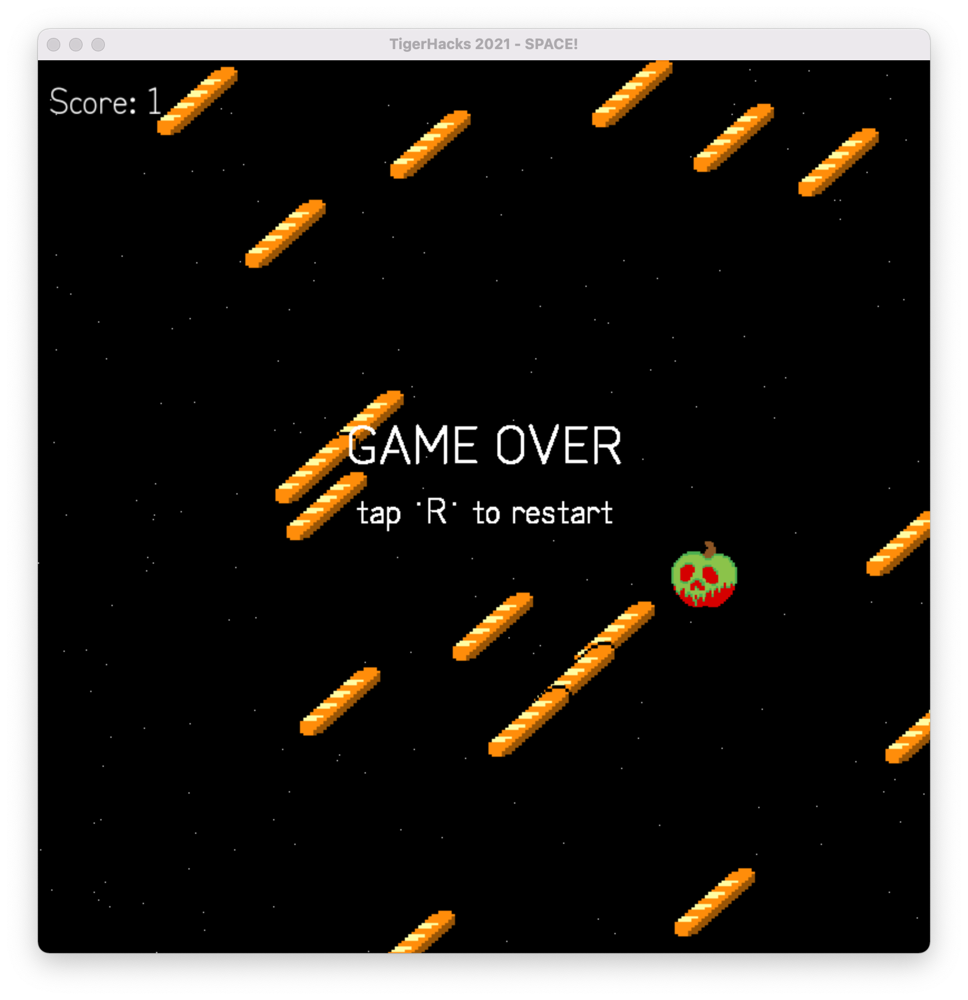

# TigerHacks_2021

Files for diving deeper into the pygame intro talk

If you want to run this project make sure you have installed [python 3](https://www.python.org/downloads/) & pygame (<code>pip3 install pygame</code>)

Run main.py

Gameplay

Game Over